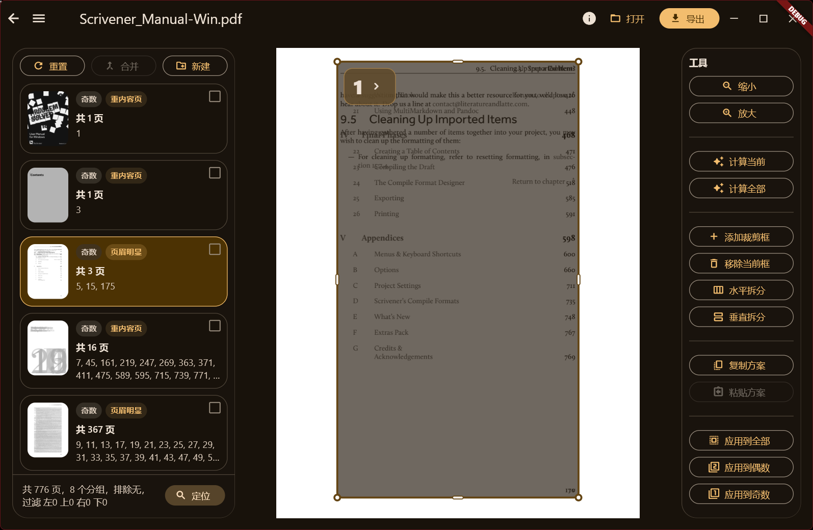
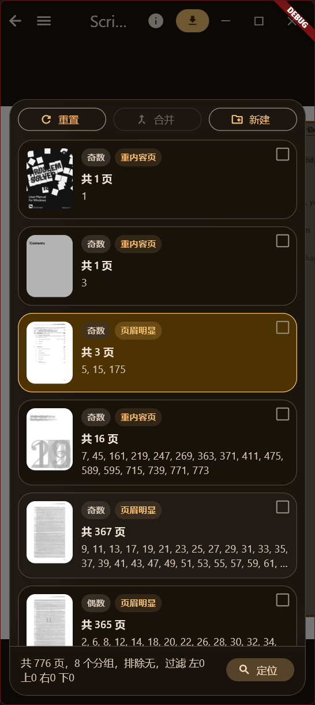

 [中文](README.md) | [English](README.en.md) | [日本語](README.ja.md)
 
 

# ProCropper PDF

一个基于 Flutter 的跨平台 PDF 裁边工具，致力于在移动端与桌面端提供更智能、更高效的 PDF 裁边体验，单应用独立运行，无需依赖额外运行环境。

本项目参考了 Briss 的叠加预览与分组裁切思路，并在此基础上进行了优化与改进。
系统能够根据页面内容（文字/墨迹分布）自动分析结构，将页面划分为不同裁切分组，并生成对应裁切区域，从而显著减少用户手动操作成本。

# 功能特性

- [x] PDF 叠加预览
- [x] 多种页面智能分组策略
- [x] 裁切框自动生成
- [x] 支持手动调整裁切框范围
- [x] 支持多页裁剪框复制粘贴
- [x] 支持为单一分组添加多裁剪框，实现割页效果
- [x] 支持手动过滤页面边缘区域
- [x] 支持锁定纵横比，为多种屏幕尺寸提供全屏体验
- [x] 支持向外扩展留白模式
- [x] 移动端支持分享导入、导出PDF
- [x] 桌面端支持参数和拖动导入
- [x] 主页支持拖动导入PDF
- [x] 编辑器页面支持响应式布局，同时适配大屏幕和小屏幕操作体验
- [x] 支持多种语言（汉语、英语、日语）
- [x] E-ink 显示优化
- [x] 处理加密的 PDF
- [x] 预览裁边效果
- [x] 多窗口（实验性）
- [x] 全自动批量裁边
- [ ] 性能优化与大文件支持增强

# 支持平台

- [x] Windows
- [x] macOS
- [x] Android
- [x] iOS
- [x] Linux（实验性）
- [ ] OHOS（适配中）

# 截图

### 标准模式（平板、电脑）

### 紧凑模式（手机）
